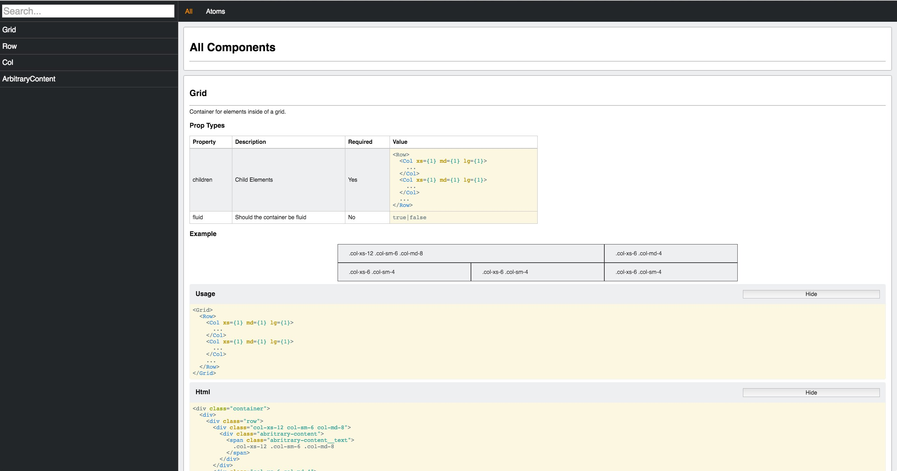

# React Component Library

This is a scaffold for a react component library.

* Expose your design as react components in a separate module so you can use them across multiple projects
* Expose compiled assets so they can be used in other projects
* Expose compiled assets with a custom loader that can be consumed by webpack
* View your components inside of a fancy library



# Getting Started

### Requirements

* node ^3.0.0

### Starting a dev server

```
chmod +x ./bin/library-server // You only have to run this once this makes the server executable

./bin/library-server // This starts a server on port 8080
or
PORT=xxxx ./bin/library-server // This starts a server on a custom PORT
```

The dev server will watch your filesystem for changes and automagically recompile assets and reload your library

### Compiling Assets

<strong>This should be done before every commit and will be set up as a pre commit hook</strong>

Assets will be checked in to version control so they can be used in client applications loaders.

```
npm build // will compile assets into dist/ folder
```
# Importing styles from another project

Include a reference to your component library in your package.json

### If you published to npm

```js
{
  ...
  dependencies: {
    ...
    'your-package-name': 'version'
  },
  ...
}
```

### Styleguide hosted with git

```js
{
  ...
  dependencies: {
    ...
    'your-package-name': 'git://github.com/user/your-component-library.git#commit'
  },
  ...
}
```

## Basic

Once you have a reference to the project your styles will live in `node_modules/your-package-name/dist/application.css` and `node_modules/your-package-name/dist/library.css` respectively.

You will probably want to set up a step in your build process that copies the files from `node_modules` into your asset folder.

## Webpack

The simplest route is to add the stylesheets as entry points to your webpack config.

```js
{
  entry: [
    ...
    './node_modules/your-package-name/dist/library.css',
    './node_modules/your-package-name/dist/application.css',
  ],
  ...
  module: {
    loaders: [
      ...
      {
        test: /\.css$/,
        loaders: [ 'style', 'css' ]
      }
    ]
}
```

Or to require them from node modules

ES5
```js
require('./node_modules/your-package-name/dist/library.css');
require('./node_modules/your-package-name/dist/library.css');
```

ES2015
```js
import './node_modules/your-package-name/dist/library.css';
import './node_modules/your-package-name/dist/library.css';
```

# Importing components from another project

Include a reference to your component library in your package.json

### If you published to npm

```js
{
  ...
  dependencies: {
    ...
    'your-package-name': 'version'
  },
  ...
}
```

### Styleguide hosted with git

```js
{
  ...
  dependencies: {
    ...
    'your-package-name': 'git://github.com/user/your-component-library.git#commit'
  },
  ...
}
```

Once you have that you can import components based on their groups

ES2015
```js
import { atoms: { Grid, Row, Col } } from 'your-package-name';

const render = () => (
  <Grid>
    <Row>
      <Col xs={6}>
        Content
      </Col>
      <Col xs={6}>
        Content
      </Col>
    </Row>
  </Grid>
);
```

ES5
```js
var components = require('your-package-name');

var Grid = components.atoms.Grid;
var Row = components.atoms.Row;
var Col = components.atoms.Col;

function render() {}
  return (
    <Grid>
      <Row>
        <Col xs={6}>
          Content
        </Col>
        <Col xs={6}>
          Content
        </Col>
      </Row>
    </Grid>
  )
}
```

# Defining Components

Components are defined in groups.

A good basline is [Atomic Design](http://patternlab.io/about.html) the groups being `atoms, molecules, organisims, templates, pages`
